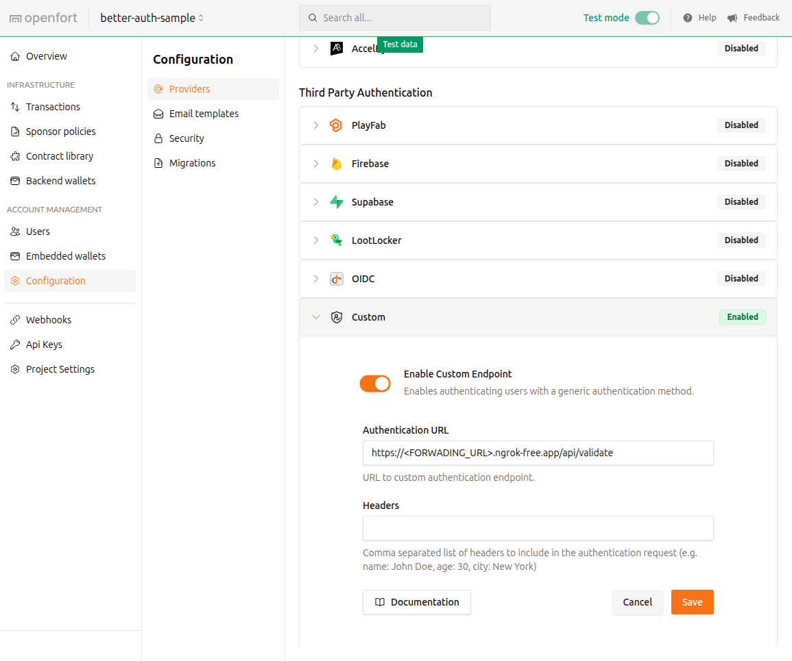

# Better Auth + Openfort

This repository contains the code for a base implementation of Openfort embedded wallet creation using third-party authentication through Better Auth (including email+password and Google sign-in).

## Project Structure

This repository features a `React + Vite` frontend located in the `/frontend` directory, designed for login, signup, and wallet inspection, and set up using the Openfortkit quickstart. Additionally, it includes an `Express.js` backend in the `/backend` directory, which handles the authentication process through Better Auth.

The `auth.ts` and `auth-client.ts` hold the Better Auth initializations for the frontend and backend respectively.
The setup of the endpoints is found at `/backend/index.ts`.

The `/frontend/src/components/` folder stores the login, register and wallet inspection pages as well as the authentication flow. `/frontend/src/lib/` stores the helpers.

## Set up

### 1. Start by cloning the repo

```bash
pnpx gitpick openfort-xyz/openfort-js examples/apps/better-auth-sample
```

### 2. Fill the `.env` files

**For the frontend**

```bash
cd frontend/ && cp .env.example .env.local
```

Fill it with the Openfort project keys and the URL of the `express.js` backend. You can create an Openfort project in the [dashboard](https://dashboard.openfort.io/).

**For the backend**

```bash
cd backend/ && cp .env.example .env
```

Fill it with the [Better Auth environment variables](https://www.better-auth.com/docs/installation#set-environment-variables), backend URL and port, and if you want to set up the authentication with Google, add your `client ID` and `client secret`. For this last part, you will need to create an OAuth application at the [Google Cloud Console](https://console.cloud.google.com/) and add the allowed callback url `http://localhost:8000/api/auth/callback/google`. Other providers can be added equivalently — check out the [Better Auth documentation](https://www.better-auth.com/docs/introduction) for the specifics.

### 3. Install the packages

**For the frontend**

```bash
cd frontend/ && yarn install 
```

**For the backend**

```bash
cd backend/ && yarn install
```

### 4. Forward your local development session

In order to allow Openfort to validate the issued tokens, the backend must be publicly accessible. You can use `ngrok` to forward the port. Use the deployed URL when in a production environment.

```bash
ngrok http <BACKEND PORT>
```

### 5. Add a custom authentication provider

Access the [Openfort dashboard](https://dashboard.openfort.io/) for your project and navigate to `Account Management > Configuration > Providers > Third Party Authentication`. Enable a custom endpoint and enter the public URL from the previous step with the validation endpoint of the backend (`/api/validate`):

<p align="center">
  
</p>

<br>

> [!WARNING]
> Every time you rerun the ngrok forwarding command, the URL will change and you will have to update this configuration.

### 6. Run the app

Run the frontend, the backend and the port forwarding at the same time:

```bash
cd frontend/ && yarn dev
```

```bash
cd backend/ && yarn dev 
```

Now you can access the frontend page in a browser to test it.

## Relevant documentation

* **[Introduction | Better Auth](https://www.better-auth.com/docs/introduction)**
  Overview of Better Auth and its approach to modern, developer-friendly authentication.

* **[Installation | Better Auth](https://www.better-auth.com/docs/installation)**
  Step-by-step guide for installing Better Auth in your project using npm or yarn.

* **[Basic Usage | Better Auth](https://www.better-auth.com/docs/basic-usage)**
  Covers how to initialize and use the Better Auth client for handling authentication flows.

* **[Email & Password | Better Auth](https://www.better-auth.com/docs/authentication/email-password)**
  Explains how to implement authentication using email and password with Better Auth.

* **[Google | Better Auth](https://www.better-auth.com/docs/authentication/google)**
  Instructions for setting up Google OAuth login in Better Auth, including callback configuration.

* **[React SDK – Openfort Documentation](https://www.openfort.io/docs/products/embedded-wallet/react/kit)**
  Official guide to using the Openfort React SDK for integrating embedded wallets in web apps.

* **[Third-party auth providers – Openfort Documentation](https://www.openfort.io/docs/products/embedded-wallet/javascript/auth/external-auth)**
  Details on integrating external authentication providers (like Firebase or custom tokens) with Openfort.

* **[Using Openfort from your server – Openfort Documentation](https://www.openfort.io/docs/products/server)**
  Explains how to securely perform server-side operations using the Openfort Node SDK.
